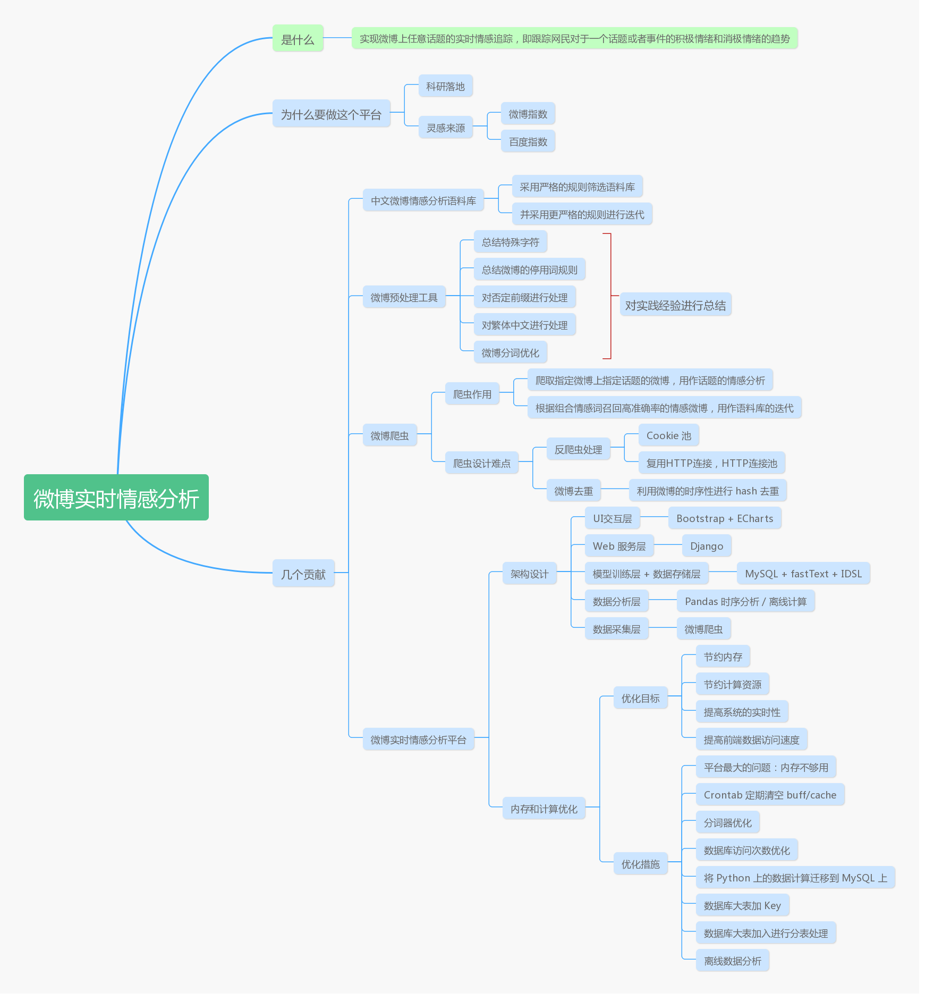

# Senti-weibo
http://sentiweibo.top : A Real-Time Sentiment Analysis System for Sina Weibo

Table of Contents
=================

   * [Senti-weibo](#senti-weibo)
      * [Open Source](#open-source)
         * [Corpus/Test-Dataset/Trained-model](#corpustest-datasettrained-model)
         * [Dictionary and Seed words](#dictionary-and-seed-words)
         * [Topic Data](#topic-data)
         * [Weibo-preprocess-toolkit](#weibo-preprocess-toolkit)
      * [Seg Tools Compare in Test Dataset](#seg-tools-compare-in-test-dataset)
      * [Snapshot-of-Senti-weibo](#snapshot-of-senti-weibo)
      * [Architecture of Senti-weibo](#architecture-of-senti-weibo)

## Open Source

### Corpus/Test-Dataset/Trained-model

|                           | download link                                                | desc                                            |
| ------------------------- | ------------------------------------------------------------ | ----------------------------------------------- |
| Senti-weibo2019(Training) | [Google Drive](https://drive.google.com/open?id=1yMCP44ICH1Gl29x920QyT9LQCnVg_2S6) | 671053 weibos, 407058 positive, 263995 negative |
| Test-Dataset              | [Google Drive](http://bit.ly/2RMGEix)                        | 1790 weibos, 1010 negative, 780 positive        |
| Trained-Model             | [Google Drive](https://drive.google.com/open?id=1duD2bIzMBjBnjOvJ9T10lR1HqKBeYarM) | 1.74 GB, precision: 90.11 %                     |
| Public-Weibo-Dataset      | [Google Drive](http://bit.ly/2KHMaSy)                        | 955MB, 35.2 million weibos                      |

**Train Demo**

Attention: The model trained by fastText can not be reproduced, we performed multiple trainings on the training set and selected the best classifier as our final classifier.

```shell
$ git clone https://github.com/facebookresearch/fastText.git
$ cd fastText
$ pip install .
```

```Python
import pandas as pd
import fastText

corpus_path = "senti_corpus.csv"
df_corpus = pd.read_csv(corpus_path, encoding="utf-8")
train_list = (df_corpus["label"] + " , " + df_corpus["seged_weibo"]).tolist()
# input must be a filepath
train_path = "train.txt" 
model_path = "senti-model.bin"
with open(train_path, "w", encoding="utf_8_sig") as fw:
    for line in train_list:
        fw.write(u"{}\n".format(line))
# train
model_classifier = fastText.train_supervised(train_path,
                                             label="__label__",
                                             dim=200,
                                             lr=0.2, 
                                             epoch=25,
                                             wordNgrams=2,
                                             )
model_classifier.save_model(model_path)
```

**Test Demo**

```Python
import fastText
import pandas as pd

test_path = "senti_test.csv"
df_test = pd.read_csv(test_path, encoding="utf-8")
test_list = (df_test["label"] + " , " + df_test["seged_weibo"]).tolist()
test_path2 = "test.txt"
with open(test_path2, "w", encoding="utf_8_sig") as fw:
    for line in test_list:
        fw.write(u"{}\n".format(line))
model_path = "senti-model.bin"
model_classifier = fastText.load_model(model_path) # input must be a filepath
result = model_classifier.test(test_path2)
print(result[1]) # accuracy
```

### Dictionary and Seed words

[README](./corpus-and-dictionary/README.md)

### Topic Data

We open-source the crawled weibos about the topic of **Huawei** and **China-US Trade**. 

| Topic          | Download Link                                                | Time                    |
| -------------- | ------------------------------------------------------------ | ----------------------- |
| Huawei         | [Google Drive](https://drive.google.com/file/d/11TgYQZrqJddoRscE08B42He4TwD7_Jh2/view?usp=sharing) | 2019-03-12 — 2019-07-01 |
| China-US Trade | [Google Drive](https://drive.google.com/file/d/1CkDvSSvYZhrx5A09getatfmiSxnY26Mq/view?usp=sharing) | 2019-04-20 — 2019-07-01 |

### Weibo-preprocess-toolkit

Weibo Preprocess Toolkit. [Github](<https://github.com/wansho/weibo-preprocess-toolkit>)

**Demo**

```shell
$ pip install weibo-preprocess-toolkit
```

```Python
from weibo_preprocess_toolkit import WeiboPreprocess

preprocess = WeiboPreprocess()

test_weibo = "所以我都不喝蒙牛 #南京·大行宫[地点]#，一直不喜欢蒙牛。謝駿毅 赞[122]转发[11] [超话] 收藏09月11日 18:57 "

# traditional2simplified
print(preprocess.traditional2simplified(test_weibo))
# 所以我都不喝蒙牛 #南京·大行宫[地点]#，一直不喜欢蒙牛。谢骏毅 赞[122]转发[11] [超话] 收藏09月11日 18:57

# clean weibo with simplified Chinese
print(preprocess.clean(test_weibo))
# 所以我都不喝蒙牛 一直不喜欢蒙牛 谢骏毅

# clean weibo 
print(preprocess.clean(test_weibo, simplified=False))
# 所以我都不喝蒙牛 一直不喜欢蒙牛 謝駿毅

# seg weibo, keep stop words
print(preprocess.cut(test_weibo))
# ['所以', '我', '都', '不喝', '蒙牛', '#', '南京', '·', '大行宫', '[', '地点', ']', '#', '，', '一直', '不喜欢', '蒙牛', '。', '謝駿毅', '赞', '[', '122', ']', '转发', '[', '11', ']', '[', '超话', ']', '收藏', '09', '月', '11', '日', '18', ':', '57', '\xa0']

# seg weibo, don't keep stop words
print(preprocess.cut(test_weibo, keep_stop_word=False))
# ['都', '不喝', '蒙牛', '#', '南京', '·', '大行宫', '[', '地点', ']', '#', '，', '不喜欢', '蒙牛', '。', '謝駿毅', '赞', '[', '122', ']', '转发', '[', '11', ']', '[', '超话', ']', '收藏', '09', '月', '11', '日', '18', ':', '57', '\xa0']

# clean and cut weibo, keep_stop_words, simplified Chinese
print(preprocess.preprocess(test_weibo))
# 所以 我 都 不喝 蒙牛 一直 不喜欢 蒙牛 谢骏毅
print(preprocess.preprocess(test_weibo, simplified=False, keep_stop_word=False))
# 都 不喝 蒙牛 不喜欢 蒙牛 謝駿毅
```

## Seg Tools Compare in Test Dataset

In order to prove the significance of consistent text pre-processing rules in the training and online environment, we compare six segmentation tools with this script: [compare.py](./seg-tools-compare/compare.py).

## Snapshot-of-Senti-weibo

[Website-snapshot](website-snapshot/README.md)

## Architecture of Senti-weibo

In Chinese: 




