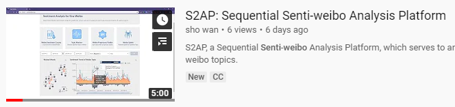
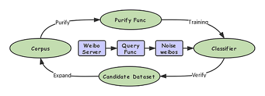
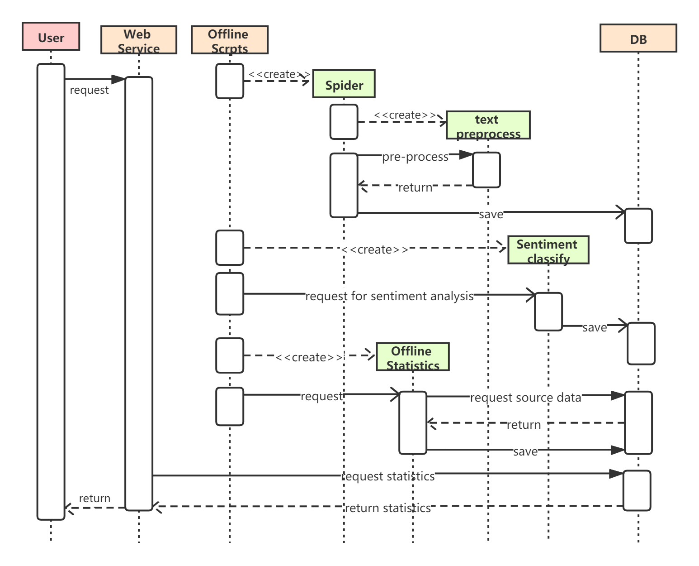
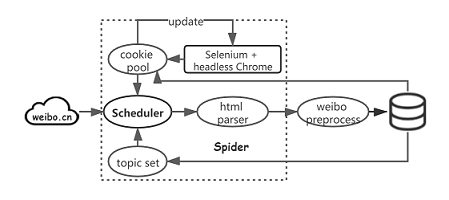

# S2AP
[[S2AP]](http://sentiweibo.top/): A Sequential Senti-weibo Analysis Platform.


## Introduction

* [Introduction video on Youtube](https://www.youtube.com/watch?v=97kOLd2Gl5E)

  

* [Introduction video on Bilibili](https://www.bilibili.com/video/av82448913)

## Open Source

### Corpus/Test-Dataset/Trained-model

|                           | Download link                                                | Desc                                            |
| ------------------------- | ------------------------------------------------------------ | ----------------------------------------------- |
| Senti-weibo               | [Google Drive](https://drive.google.com/open?id=1yMCP44ICH1Gl29x920QyT9LQCnVg_2S6) | 671053 weibos, 407058 positive, 263995 negative |
| Test-Dataset              | [Google Drive](http://bit.ly/2RMGEix)                        | 1790 weibos, 1010 negative, 780 positive        |
| Trained-Model by fastText | [Google Drive](https://drive.google.com/open?id=1duD2bIzMBjBnjOvJ9T10lR1HqKBeYarM) | 1.74 GB                                         |
| Public-Weibo-Dataset      | [Google Drive](http://bit.ly/2KHMaSy)                        | 955MB, 35.2 million weibos                      |

Training and test scripts can be available at [training_and_test.py](./scripts/training_and_test.py)

### Dictionary and Seed words

Details at [README](./corpus-and-dictionary/README.md)

### Topic Data

We open-source the crawled weibos about the topic of **Huawei** and **China-US Trade**. 

| Topic          | Download Link                                                | Time                    |
| -------------- | ------------------------------------------------------------ | ----------------------- |
| Huawei         | [Google Drive](https://drive.google.com/file/d/11TgYQZrqJddoRscE08B42He4TwD7_Jh2/view?usp=sharing) | 2019-03-12 — 2019-07-01 |
| China-US Trade | [Google Drive](https://drive.google.com/file/d/1CkDvSSvYZhrx5A09getatfmiSxnY26Mq/view?usp=sharing) | 2019-04-20 — 2019-07-01 |

### Weibo-preprocess-toolkit

Open-sourced on [Github](<https://github.com/wansho/weibo-preprocess-toolkit>). In order to prove the significance of consistent text pre-processing rules in the training and online environment, we compare six segmentation tools with this script: [segmentation_tools_compare.py](./scripts/segmentation_tools_compare.py).

**Demo**

```shell
$ pip install weibo-preprocess-toolkit
```

```Python
from weibo_preprocess_toolkit import WeiboPreprocess

preprocess = WeiboPreprocess()

from weibo_preprocess_toolkit import WeiboPreprocess

toolkit = WeiboPreprocess()
test_weibo = "所 以 我 都 不 喝 蒙 牛， 一 直 不 喜 歡 蒙 牛。 #南 京· 大 行 宫[地 点]# 赞[122]转发[11] [超 话] 收 藏09月11日 18:57"
cleaned_weibo = toolkit.clean(test_weibo)
print(cleaned_weibo)
# ’所 以 我 都 不 喝 蒙 牛 一 直 不 喜 欢 蒙 牛’
print(toolkit.cut(cleaned_weibo))
# [’所 以’, ’我’, ’都’, ’不 喝’, ’蒙 牛’, ’一 直’, ’不 喜 欢’, ’蒙 牛 ’]
print(toolkit.preprocess(test_weibo , simplified=True , keep_stop_word=True))
# ’所 以 我 都 不 喝 蒙 牛 一 直 不 喜 欢 蒙 牛’
```

## Details of S2AP

### Corpus Iteration

 In fact, the iteration can be interpreted as a process of sifting sands out of flour. Given a sieve and some flour to be sifted, our goal is to sift out the sand with sieve. The difficulty is that the holes on the sieve are not all small holes, there will always be sands mixed into flour. Purify Function plays an important role in this part. Classifier trained by initialized corpus will lead to over-fitting iff we apply it to purify the corpus. So we divide the corpus into training set and verification set, and sample subset of training dataset to train the classifier many times. Multiple classifiers are used to verify the sentiment label of the verification dataset, and then sift out the samples whose classification results are not unified. Query Function can help to continuously recall new high-quality data to guarantee the robustness of the model. 



### UML of S2AP



### Weibo Topic Spider



### Snapshot of S2AP

Details at [Website-snapshot](website-snapshot/README.md)


