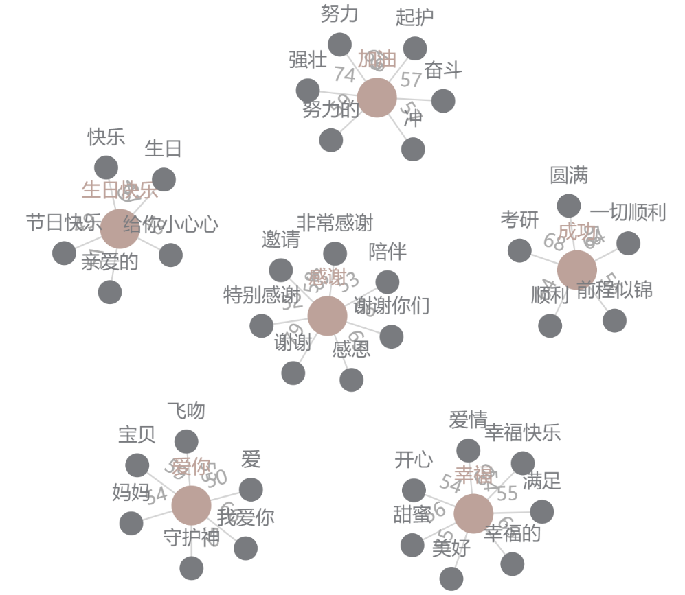

# 词典与数据集

## 测试集

选取了 COAE2014(Chinese Opinion Analysis Evaluation) 的 positive 和 negative 数据集作为测试集，coae2014提供的微博数据集微博为 40000 条，其中标准好的样本约为 7000 条，这 7000 条微博作为比赛的测试集。由于比赛组委会并没有公开已经标注好的 7000 条微博，所以我们只能自己手动标注，构造测试集，最终标记出 1790 条微博作为测试集。 

标注的原则为，对于一条微博来说：

1. 如果该微博传达除了比较强烈的感情色彩，则对其进行情感标注，并加入测试集
2. 如果人都很难判断这条微博的情感色彩，或者该条微博的情感色彩偏中立，那么该微博不作为测试集
3. 如果该条微博中有两种情感色彩，那么选取情感色彩最浓的情感作为标签，并加入测试集

## 词典

* [特殊字符集](special_chars.csv)
* [典型情感 emoji 词典](sentiemnt-emojis.csv) 
* [NTUSD 消极情感词典](ntusd-negative.txt)，[NTUSD 积极情感词典](ntusd-positive.txt)
* [微博停用词规则1](weibo_stopwords1_regex.csv)，[微博停用词规则2](weibo_stopwords2_regex.csv)
* [jieba 扩展词典](jieba_expanded_dict.txt)

## Banned words and Seed words



[新华社：新闻信息报道中的禁用词和慎用词(2016年7月修订)](http://dfz.shaanxi.gov.cn/zjyd/fzzs/201711/t20171103_935357.html)

> 装逼、草泥马、特么的、撕逼、玛拉戈壁、爆菊、JB、呆逼、本屌、齐B短裙、法克鱿、丢你老母、达菲鸡、装13、逼格、蛋疼、傻逼、绿茶婊、你妈的、表砸、屌爆了、买了个婊、已撸、吉跋猫、妈蛋、逗比、我靠、碧莲、碧池、然并卵、日了狗、屁民、吃翔、××狗、淫家、你妹、浮尸国、滚粗。

Example of Seed words and generated words

```json
"装逼": {'智障': 0.7758968472480774, 'low': 0.7677356004714966, '疯狗': 0.7561292052268982, '没出息': 0.7546122074127197},
 "草泥马": {'妈蛋': 0.7060734629631042, '要死': 0.6852079033851624, '装逼': 0.6451303958892822, '日了狗了': 0.6368067860603333},
 "撕逼": {'喷粪': 0.7526323199272156, '特么': 0.7303978204727173},
 "玛拉戈壁": {'呆逼': 0.7362445592880249, 'nmsl': 0.7221044301986694},
 "傻逼": {'卖惨': 0.8485166430473328, '喷粪': 0.8425860404968262, '撒泼': 0.8190003633499146},
 "妈蛋": {'草泥马': 0.7060734629631042, '卧槽': 0.6918505430221558, '要死': 0.6704453229904175, '日了狗了': 0.6564552783966064},
 "日了狗了": {'日了狗': 0.8600899577140808, '无语': 0.7921737432479858, '气死我了': 0.7680628299713135, '烦死了': 0.7614803314208984, '尼玛': 0.7486643195152283, '呕': 0.7454837560653687, '日狗': 0.7443450689315796, 'tmd': 0.738621711730957},
 "碧池": {'贱人': 0.7951254844665527, '白莲花': 0.7813047170639038, '屌': 0.7802146077156067, '圣母': 0.7672637104988098, '婊': 0.760465145111084, '破鞋': 0.7599434852600098, '傻子': 0.7469720244407654, '装逼': 0.7433446645736694, '智障': 0.7414700984954834}

 '幸福': {'幸福的': 0.6637616753578186, '幸福快乐': 0.6038797497749329, '甜蜜': 0.5629810094833374, '美好': 0.5599392652511597, '满足': 0.5518359541893005, '爱情': 0.5461633801460266, '开心': 0.5448060035705566}, 
 '爱你': {'我爱你': 0.6611090302467346, '宝贝': 0.5978685617446899, '妈妈': 0.5458383560180664, '飞吻': 0.5353448390960693, '守护神': 0.5208351612091064, '爱': 0.5011919736862183}, 
 '感谢': {'谢谢': 0.794333279132843, '谢谢你们': 0.6611555814743042, '感恩': 0.6500781774520874, '非常感谢': 0.5893584489822388, '陪伴': 0.5310890674591064, '邀请': 0.5309898853302002, '特别感谢': 0.529721736907959},
'加油': {'强壮': 0.7408491969108582, '努力': 0.6952217817306519, '起护': 0.6131818294525146, '努力的': 0.5932266116142273, '奋斗': 0.5781823396682739, '冲': 0.5762098431587219}, 
'成功': {'考研': 0.6869702339172363, '顺利': 0.6499309539794922, '一切顺利': 0.6484599113464355, '圆满': 0.5838222503662109, '前程似锦': 0.5647206902503967}, 
'生日快乐': {'生日': 0.643157958984375, '快乐': 0.6107043027877808, '亲爱的': 0.510920524597168, '节日快乐': 0.4944956302642822, '给你小心心': 0.48009395599365234}
```

